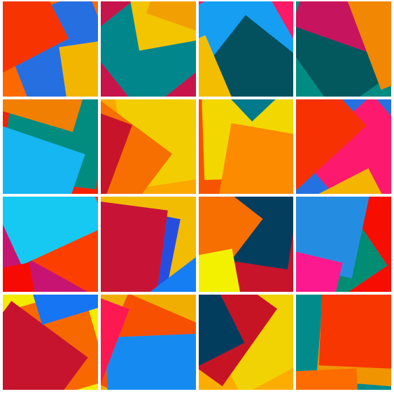

| Statements                  | Branches                | Functions                 | Lines             |
| --------------------------- | ----------------------- | ------------------------- | ----------------- |
|  |  |  |  |

# @cfx-kit/wallet-avatar


🤡 A library for generate MetaMask avatars based on account address.

✨ For example, use the metamask account to generate an avatar. You can get the same avatar as metamask. Of course you don't have to use metamask account.

🤣 Say goodbye to boring blocky identicons that look like they came out of the 70s, and replace them with jazzy, colorful collages that more likely came out of the 80's.

## Overview 🧐

The `@cfx-kit/wallet-avatar` library is a collection of functions that can help you generate the same avatar as metamask. Install it and look at its definition and you'll be up and running in no time.



## Installation 📦

### npm

```npm install @cfx-kit/wallet-avatar```

### yarn

```yarn add @cfx-kit/wallet-avatar```

## Demo

For React [codesandbox/@cfx-kit/wallet-avatar](https://codesandbox.io/s/cfx-kit-wallet-avatar-demo-beqzvz?file=/src/App.js)

## Usage 📚

```tsx
import { generateAvatarURL } from '@cfx-kit/wallet-avatar';

const img = document.createElement('img')

img.src = generateAvatarURL('0x368d31aeB0aBc22E4a020B1ceba386089fc3aCc6')

document.body.appendChild(img)

```
